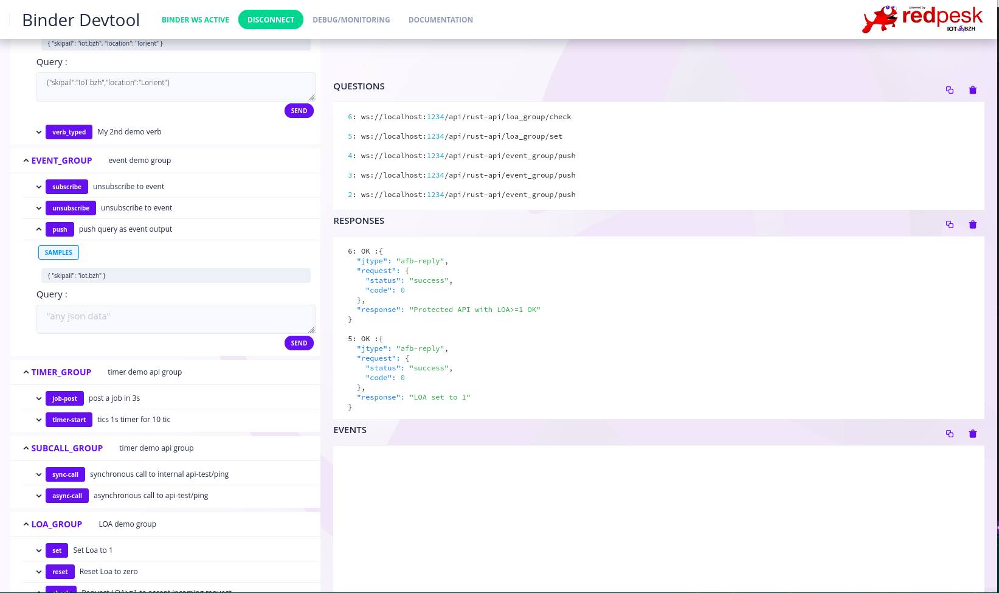

# Exposes afb-libafb to rust language

This module permit to develop afb-binding that are fully compatible with C/C++ ones.

Afb-librust provides a rust native safe api to full libafb binding functionalities.



For more information about installation, run and test, click on the following links:

* [Installation Guide](.docs/2-installation_guide.html)
* [Rust Binding API](./docs/3-configuration.html)
* [Running and Testing](.docs/4-running_and_testing.html)

request.get_session() // return une session init a zero
request.drop_session() // delete l'object session

## Compilation bugs

Something cargo complains about ```stddef.h``` which is own by ```kernel-headers```
 * install kernel-headers
 * install clang


## Tests

It is possible to run tests on this library by calling the following script.

```bash
./afb-tests/etc/binding-test.sh
```

### Coverage

In order to get the coverage of the tests, firstly you need to install additional tools.
This can be done by running the commands here below.

```bash
# Install rust compatible llvm tools
rustup component add llvm-tools-preview

# Install grcov
cargo install grcov
```

Once the tools are all set-up you can call the test script with the coverage option.

```bash
./afb-tests/etc/binding-test.sh
```

At the end, the entry point of html coverage report is: `target/debug/coverage/index.html`.