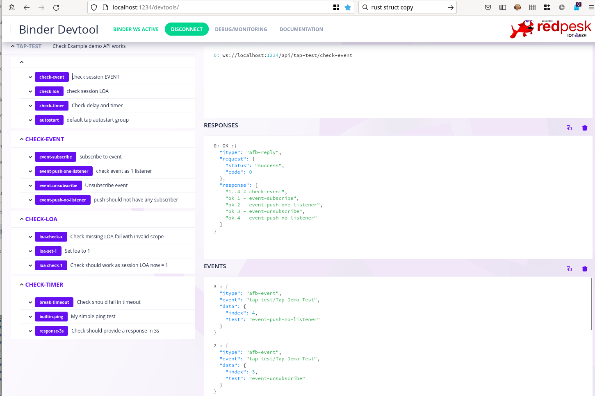

# Testing your RUST api



## overview

afb-librust provides a TAP (Test Anything Protocol) framework. Testing API may run either automatically in batch mode or on demand in REST/WebSocket mode.
Technically a RUST test module in only a specialized binding. This allow to leverage afb-binder capabilities and user may choose to run test directly from
APIs afb-binder process or from an external process.

* first model is very convenient when using a source debugger.
* second model allows to run the test suite from a host when APIs remains on the target.

Tests are created with ```AfbTapTest::new``` method. Newly created test should then be added to a group (AUTORUN is default group). Custom user defined group:

* should be added to test API.
* group uid should be attach a test exit label onsuccess/onerror

Test may run on two modes:

* API on demand mode: user selects a specify test/group and launch it from devtool UI, afb-client, CURL, ... TAP result are return JSON object.
* AUTORUN automatic mode: in this case test start from 1st AUTORUN test and depending on onsuccess/onerror switch to a user defined group.

Example of CLI interaction
```
afb-client -H localhost:1234/api rust-api info
```

Example of batch autorun/autoexit mode

```bash
afb-binder --config=examples/test/etc/binding-test-auto.json

1..5 # autostart
ok 1 - builtin-ping
ok 2 - jsonc-arg
ok 3 - jsonc-reply
ok 4 - jsonc-arg
ok 5 - MySimpleData

1..3 # check-loa
ok 1 - loa-check-x
ok 2 - loa-set-1
ok 3 - loa-check-1

1..4 # check-event
ok 1 - event-subscribe
ok 2 - event-push-one-listener
ok 3 - event-unsubscribe
ok 4 - event-push-no-listener

1..3 # check-timer
not ok 1 - break-timeout # status=0 info=Success
ok 2 - builtin-ping
ok 3 - response-3s
```

## coding a test

A test is composed of

* uid: this is a free text (spec reference, bug reference, ...)
* api/verb: point on the API to be tested. Note:
  * one test suite may test multiple APIs
  * api may either be local or remote
  * optional api input arguments
* expected replies
  * status return (default 0)
  * optional data. Note than when expect json replies jsonc::contains is used in place of jsonc::equal
* optional group labels
  * onsuccess switch to new group if test succeed
  * onerror same thing when test fails
* optional timeout
  * default uses group timeout
  * group default uses suite default
  * builtin default is 5s

```rust
let testa= AfbTapTest::new("jsonc-arg", "rust-api", "verb_typed")
    .set_info("Check json typed input")
    .add_arg(&JsonStr("{'skipail':'Follijen','location':'PortLouis','lander':'Brittany'}")).expect("valid argument")
    .add_expect(&JsonStr("{'LANDER':'BRITTANY'}"))
    ;

let testb= AfbTapTest::new("MySimpleData", "rust-api", "verb_typed")
    .set_info("Check invalid typed input")
    .add_arg(MySimpleData{x:256,y:1024,name:"Skipail IoT.bzh".to_owned()}).expect("valid SimpleData")
    .set_onsuccess("check-loa")
    ;
```

## adding test to group

When not push directly into AUTORUN group, test are added a user defined group. Note that when using API/Ondemand mode each
group generate a verb that execute corresponding group, when each test within the group generate a verb prefixed with group/uid.

```rust
let loa_group= AfbTapGroup::new("check-loa")
    .set_info ("check session LOA")
    .add_test(loa1)
    .add_test(loa2)
    .add_test(loa3)
    ;
```

## adding test and group to test suite

The test suite contains:

* builtin AUTORUN group
* optionally user defined groups
* flags:
  * autorun: true/false launch or not autorun a afb-binder startup
  * autoexit: true/false exit afb-binder process at the end test
  * output: JSON/TAP defined default output format with using autorun mode. Api/Ondemand only support JSON(TAP).
* finalize: start test suite processing.

```rust
impl AfbApiControls for TapUserData {

fn start(&mut self, api: &AfbApi) -> i32 {
  let test_suite= AfbTapSuite::new(api, "Tap Demo Test")
    .set_info("Check Example demo API works")
    .set_timeout(0)
    .add_test(test1)
    .add_test(test2)
    .add_group(event_group)
    .add_group(loa_group)
    .set_autorun(true)
    .set_autoexit(false)
    .set_output(AfbTapOutput::TAP)
    .finalize();
    let status= match test_suite {
        Err(error) => {
            afb_log_msg!(Critical, &api, "Tap test fail to start error={}", error);
            AFB_ABORT
        },
        Ok(_json) => AFB_OK
    };
}
}
```

## Adding your test suite within a binding

As RUST TAP suite is a binding, its requires as for any other binding an API to be created. Technically TAP test suite only start when API is created within API ```start``` method of AfbApiControls trait.

```rust
pub fn binding_test_init(rootv4: AfbApiV4, jconf: JsoncObj) -> i32 {
    let uid= match jconf.get::<String>("uid") {
        Ok(value) => value,
        Err(_error)=> "Tap-test-rootv4".to_owned(),
    };

    let tap_config= TapUserData {
        autostart: true,
        autoexit: true,
        output: AfbTapOutput::TAP,
    };

    // custom type should register once per binder
    demo_converter::register(rootv4).expect("must register custom type");

    afb_log_msg!(Notice, rootv4, "-- rootv4 {} loaded", uid);
    match AfbApi::new("tap-test")
        .set_info("Testing Tap reporting")
        .require_api("rust-api")
        .set_callback(Box::new(tap_config))
        .seal(false)
        .finalize()
    {

        Ok(api) => {
            afb_log_msg!(Notice, rootv4, "Tap test starting uid={}", api.get_uid());
            AFB_OK
        }
        Err(error) => {
            afb_log_msg!(Critical, rootv4, "Fail to register api error={}", error);
            AFB_ABORT
        }
    }
}

// register rootv4 within libafb
AfbBindingRegister!(binding_test_init);
```

## Test coverage

```bash
# you need Rust grcov
cargo install grcov
rustup component add llvm-tools-preview

CARGO_INCREMENTAL=0 RUSTFLAGS='-Cinstrument-coverage' LLVM_PROFILE_FILE='cargo-test-%p-%m.profraw' cargo test jsonc

# generate HTML report
mkdir -p target/coverage/html
grcov . --binary-path ./target/debug/deps/ -s . -t html --branch --ignore-not-existing --ignore '../*' --ignore "/*" -o target/coverage/html
firefox target/coverage/html/inde.html

# generate LCOV report
mkdir -p target/coverage
grcov . --binary-path ./target/debug/deps/ -s . -t lcov --branch --ignore-not-existing --ignore '../*' --ignore "/*" -o target/coverage/lcov.info

# clean up intermediary files
rm *.profraw
